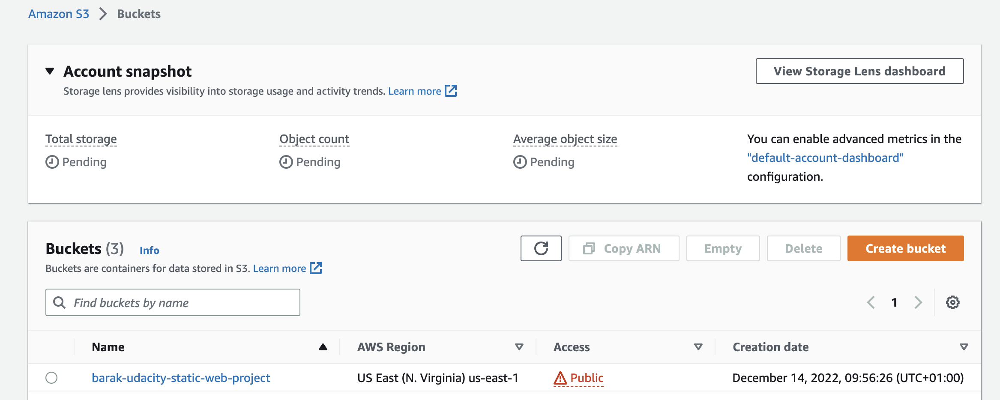

# Udacity Cloud DevOps Nanodegree

## Project 1: Static Web Application Hosting

### Pictures

Please find below my submission for the static Web Hosting Project

#### Figure 1 (S3 Bucket)

#### Figure 2 (S3 Static Web Config)

#### Figure 3 (S3 Content)

#### Figure 4 (CloudFront Setup)

#### Figure 5 (Website - S3 Object access)

#### Figure 6 (Website - Endpoint access)

#### Figure 7 (Website - CloudFront access)

### URLs

- [S3 Object](https://barak-udacity-static-web-project.s3.amazonaws.com/index.html)
- [S3 Static Website Endpoint](http://barak-udacity-static-web-project.s3-website-us-east-1.amazonaws.com)
- [CloudFront](https://d1q1jqahkwkgx.cloudfront.net/)

Thank you.
